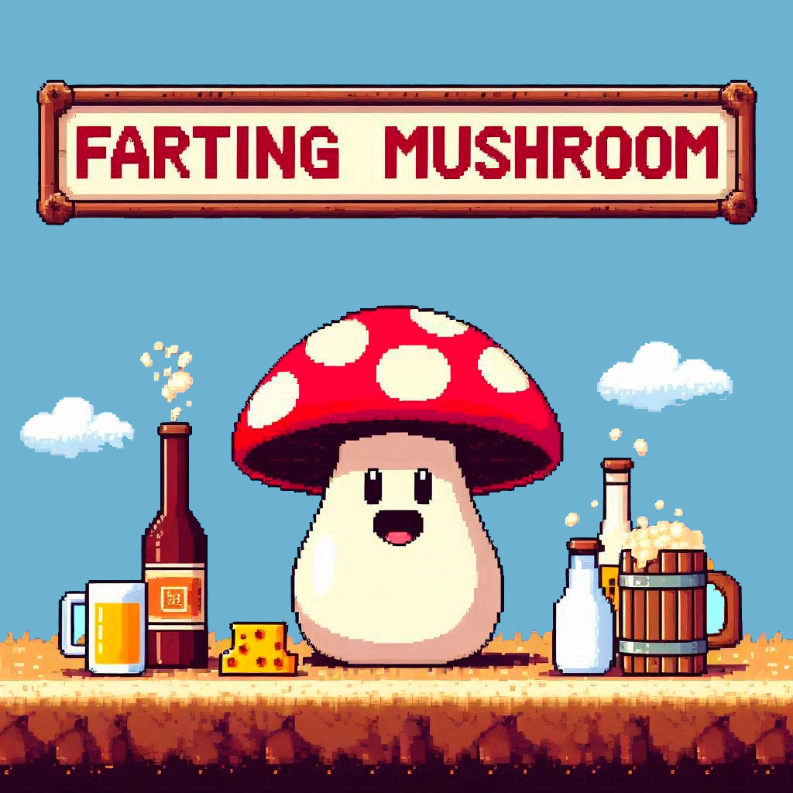

# FARTING MUSHROOM

## [Play the Game!]

# Description

Farting Mushroom es un juego para la gente intolerante a la lactosa. Tú eres un hongo y tienes que esquivar quesos y botellas de leche que caen del cielo, porque si te caen tres encima, pierdes. Pero no todo es malo, también puedes ganar puntos agarrando vino y cerveza. Además, puedes disparar enzimas para romper la lactosa. Al final, te dicen cuánta cerveza o vino has tomado y si eres un honguito pedorro.

# Main Functionalities

- El movimiento del hongo se controla con las teclas de flecha. Para moverte a la izquierda, presiona la flecha izquierda; para moverte a la derecha, presiona la flecha derecha.
- Puedes disparar enzimas que descomponen la lactosa usando la barra espaciadora de tu teclado.
- El juego comienza con tres vidas.Si te caen más de tres objetos de lactosa, morirás. Por cada objeto que te caiga, perderás una vida. 
- Obtienes puntos atrapando objetos de cerveza y vino. El puntaje total de alcohol conseguido aparecerá al final del juego en la pantalla de "Game Over".

# Backlog Functionalities

- Hacer que el juego sea responsivo.
- Agregar un hongo de un color diferente cuando el puntaje llegue a 50 puntos. 
- Crear una función que permita al hongo saltar para obtener una inyección que lo hará invencible durante 30 segundos.
- Agregar distintos efectos de sonido por cada objeto que caiga sobre el hongo.
- Crear distitnos niveles del juego.

# Technologies Used

- HTML
- CSS
- JavaScript
- Manipulacion de DOM
- OOP
- JS Audio y JS Imagen

# States

- Pantalla de inicio
- Pantalla de juego
- Pantalla de final

# Proyect Structure

## main.js

- startGame();
- gameLoop();
- goodObjAppear();
- badObjAppear();
- pillAppear();
- colisionHonguitoObjBad();
- colisionPillsObjBad();
- colisionHonguitoObjGood();
- gameOver();
- reStartGame();

## honguito.js

- Honguito ()
    - this.node;
    - this.node.src;
    - this.x;
    - this.y;
    - this.w;
    - this.h;
    - this.movementSpeed;
    - this.imageNumber;
    - this.vida;
    
- movement()
- changeImage()

## FallingObjGood.js 

- FallingObjGood ()
    - this.node;
    - this.node.src;
    - this.x;
    - this.y;
    - this.w;
    - this.h;
    - this.speed;
    

- automaticMovement()

## FallingObjBad.js 
- FallingObjBad ()
    - this.node;
    - this.node.src;
    - this.x;
    - this.y;
    - this.w;
    - this.h;
    - this.speed;

- automaticMovement()

## ShootPills .js 
- ShootPills  ()
    - this.node;
    - this.x;
    - this.y;
    - this.w;
    - this.h;
    - this.speed;

- automaticMovement()

# Extra Links 

### Slides
[Presentación](https://www.canva.com/design/DAGKDzPvlQ0/JJWBW_FEcUfhir-_F0pCxQ/view?utm_content=DAGKDzPvlQ0&utm_campaign=designshare&utm_medium=link&utm_source=editor)

## Deploy
[Juego](https://sheylare.github.io/Module1Project-Sheyla-Arellano/)